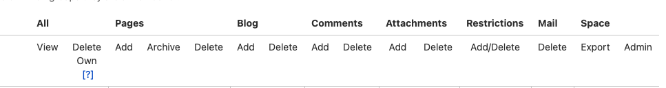

# Analysis of Confluence as a Single Source of Truth

The purpose of this document is to present a brief analysis of Confluence as a
single source of truth (SSOT) for Wizeline.

## Advantages and Disadvantages of Confluence as a Single Source of Truth

Confluence as SSOT has some advantages and disadvantages, this section considers those that have a bigger impact.

### Advantages

Confluence as SSOT has the following advantages:

- **Confidentiality**: Customizable permissions enable you to restrict access to specific documents.
- **Accessibility**: Ease of content creation.
- **Tool integration**: [Confluence integrations and
  apps](https://www.atlassian.com/software/confluence/guides/expand-confluence/confluence-integrations#team-collaboration)
  and links to other Atlassian products enhance the user experience and provide
  versatility.
- **Adoption rate**: Confluence has a higher usability and adoption rate as it
  includes a Rich Text Editor (RTE) within the platform.
- **Already used**: Confluence is already well adopted within Wizeline, and is
  inherently connected to JIRA, another platform extensively in use within
  Wizeline.
- **Identity and access**: Confluence has a built-in identity and access
  management (IAM), which suits the organization's needs for documentation.
- **Version control**: Confluence has internal version control, the versioning
  is maintained independently of the way you contribute (git or RTE).

Here is an example of a well-maintained Confluence site: [Wizeline Technical
Writers
(WTW)](https://wizeline.atlassian.net/wiki/spaces/WTW/overview?homepageId=1263928952).

### Disadvantages

Confluence as SSOT has the following disadvantages:

- **Automation cost**: Each plugin or application for governance or automation requires you to buy a license.
- **Collaboration**: It is challenging to collaborate at the same time on the platform.
- **Scalability**: Confluence projects are difficult to [scale](https://about.gitlab.com/handbook/handbook-usage/#wiki-handbooks-dont-scale).
- **Search capabilities**: Search is limited; it is not easy to find
  information if you don't know the proper keywords, labels, and spaces.
- **Governance**: Governance in Confluence is similar to Google Drive’s;
  governance rules must be in place and enforced by the company, but
  ultimately, they are the responsibility of the contributors.
- **Contributions**: There is a limited number of contributors that can update
  the Confluence space, this can create workflow issues.
- **Outdated content**: Outdated content often exists on Confluence, this defeats the purpose of acting as SSOT.
- **Human source of truth**: Up to date information often exists in a draft form
  accessible to only a few contributors; this leads teams to depend on a human
  source for the updated information.

## Confluence Success Story

A global brand shared with Atlassian their experience successfully using
Confluence as SSOT and [creating and maintaining
it](https://www.atlassian.com/blog/confluence/how-to-create-and-maintain-a-single-source-of-truth
). The main takeaways of their success are:

- Decentralize authority and centralize information.
- Create a single source of truth.
- Maintain that single source of truth.
- Create and cross-train on processes.

## Confluence as a Single Source of Truth for Wizeline

The following sections explore the different things Wizeline must consider
to implement Confluence as an SSOT for Wizeline.

### How to Any Wizeliner to Contribute

It is important to consider Access Management around spaces and pages. Confluence admits
a certain level of access granularity, you can set gatekeepers for users and
groups per space and page.

The following image provides a visual of the currently available options:

On the other hand, maintenance and administration are manual, difficult, and
only available for a small group of admins and space admins.

### How to Keep Information Up to Date

Wizeline can set up tools to highlight out-of-date content, and if it is not updated,
archive it. There is an option for a [manual
process](https://community.atlassian.com/t5/Confluence-articles/How-I-keep-Confluence-organised-and-relevant-This-might-help-you/ba-p/1572378)
but Wizeline can buy tooling or use [self-made](https://developer.atlassian.com/server/confluence/writing-confluence-plugins/)
tools.

The following are a couple of available tools:

- [Outdated for Confluence](https://marketplace.atlassian.com/apps/1219467/outdated-for-confluence?tab=overview&hosting=server)
- [Better Content Archiving for Confluence](https://marketplace.atlassian.com/apps/123/better-content-archiving-for-confluence?hosting=server&tab=overview)

Tooling is not ideal because it is [expensive and
 licensed](https://marketplace.atlassian.com/apps/123/better-content-archiving-for-confluence?hosting=server&tab=pricing)
 per number of users, which means that it is not a one time buy.
 Atlassian developer is not a core skill for Wizeline engineering, maintaining
 the tools can be difficult.

### How to Decentralize the Governance of Documentation

Traffic lights are a great example of decentralized governance. City traffic
lights can be timed individually or in small groups, or they can react to
sensors. However, for the city as a whole, there is no need for a “master”
traffic control center to keep cars moving. In this example, local
optimizations work together to provide a city-wide solution. Decentralized
governance applied to an SSOT helps remove potential bottlenecks that would
prevent contributors from submitting documentation.

Confluence does not have automated checks; Wizeline must rely on a gated review
process, education, and following standardized procedures.
It is possible to implement one or more of the following tools:

- [Comala Document Management](https://marketplace.atlassian.com/apps/142/comala-document-management?hosting=server&tab=overview)
- [Page Approval for Confluence](https://marketplace.atlassian.com/apps/144/page-approval-for-confluence?tab=pricing&hosting=datacenter)
- [Pull Requests for Confluence Pages](https://marketplace.atlassian.com/apps/1222574/pull-requests-for-confluence-pages?tab=overview&hosting=cloud)

As mentioned before, these tools are expensive and if they don't have a specific
feature, it is not simple to add it; possible solutions can be complex.

### How to Propose Changes Across Multiple Documents or Pages

On Confluence, changes across multiple documents or pages are
not possible with a single proposal, it is limited to one page at a time.

### How to Make Contributing Accessible for Non-Technical and Technical users

Adding content to Confluence is simple; if a user has used a rich text editor,
they can easily make contributions. The challenge is maintaining a structure for
the content. Every content creator must have visibility of where they can
create a new page and follow a structure set by the team.

### How to Make Finding Information Easy and Intuitive

The key to having the best possible experience when looking for information is
the set up of Confluence Spaces and Pages. There are best practices that will make
finding information easier; for example, these
[guidelines](https://docs-guide.readthedocs.io/en/latest/structure/) can be a
good place to start. You must keep in mind that search is dependent mainly on
labels and title text.

### How to Make Async Collaboration Possible

Async collaboration can come in the form of collaborative editing and review
processes. It is possible to work a collective strategy for Confluence
content, but there are significant limitations, as this
[article](https://confluence.atlassian.com/doc/collaborative-editing-858771779.html)
explains.

### How to Make Wizeliners Aware of Needed Contributions

A helpful tool for pending tasks is Jira, where the team can set up a board and
follow up on the backlog. Confluence integrates well with other Atlassian
products and Wizeliners are already familiar with Jira.

### How to Get Feedback from the Right People for Contributions

Similar to [How to Decentralize the Governance of
Documentation](#How-to-Decentralize-the-Governance-of-Documentation) Wizeline
needs tooling and governance to achieve this.
