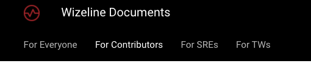
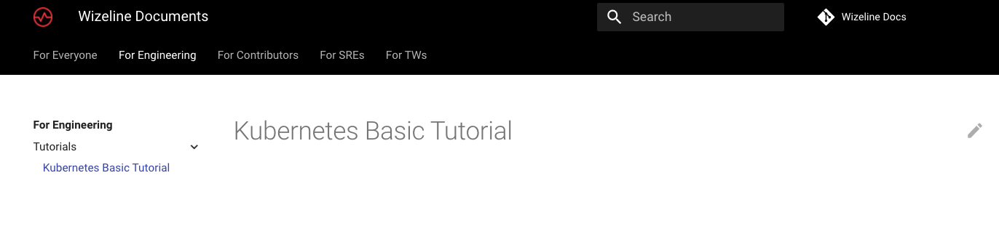

## Project and Structure Considerations

Most documentation grows organically, meaning that there is no structure or a defined standard to follow. To create a standard in the
Wizeline Documentation project, the team considers the following:

- If content creators do not know where to store their content, the structure is deficient.

- The readers and consumers of the content do not read the complete documentation from start to finish. Therefore, there is no sense in structuring
  documentation placement for the reader.

- Readers need value from content. Information is no longer a value; filtering, accessing, granting permissions, having up-to-date information, and guidance are
now values that documentation gives. Considering this, the team ensure to maintain a **navigation** that makes the documentation easy to search.

- Building and creating new documents is easy, but maintaining and keeping documentation up to date is **hard**

- Governance and tooling are essential to maintain structure and documentation quality.

- Content creators fall under three types of personas:
  
  - **Non-technical**: People that are not familiar with `git` or Markdown. This persona works easier with *WYSIWYG* (what you see is what you get) editors or a
  user interface-based platform to contribute to the content.
  
  - **Mid-level technical**: People who understand git and Markdown can use tools locally and commit changes.
  
  - **Highly technical**: People who understand the git environment entirely and do not need any guidance on tooling. They contribute to the creation of new tools
  and content.

## Structure Proposal

The following sections include a collection of proposals for the project.

### Decoupled Navigation from File Location

MkDocs requires a [yml file](https://www.mkdocs.org/user-guide/configuration/) for the navigation's configuration. The team opted to create an
[automation tool](https://github.com/wizeline/wizedocs/pull/16) that automatically completes this information based on the front matter of the Markdown file.

Sections determine the placement of the document in the site's navigation. See the following example:

Sample Front Matter
**File Name**: `wizedocs.md`

```yml
---
title: Wizeline Docs as Code
summary: Wizeline docs as code is an internal documentation tool built using MkDocs.
authors:
    - Mario Morales
labels: wizeline, tw
sections: 
  - For Everyone
---

```

The following is a sample of the `mkdocs.yml` configuration file:

```yml
nav:
- For Everyone:
  - Wizeline Docs as Code: wizedocs.md
```

You can also configure multiple navigation levels. See the following example:

**Filename**: `contributors.guidelines.md`

```yml
---
title: Contributor Guidelines
summary: A brief description of my document.
authors:
  - Tom
labels: wizeline, docops, guidelines
sections:
  - For Contributors/Guidelines
---
```

The following is a sample of the `mkdocs.yml` configuration file:

```yml
nav:
- For Contributors:
  - Guidelines: contributors.guidelines.md
- For SREs:
```

This practice provides the team with the following benefits:

- Filename and location decoupled from the navigation.
- All information, Markdown metadata, and content are in one place.
- Front matter is not visible to the documentation consumers and enables flexibility for tooling.

### File Location

Document creators must place the Markdown files in the `docs/` folder root following a `.` separated canonical [hierarchies](https://wiki.dendron.so/notes/f3a41725-c5e5-4851-a6ed-5f541054d409.html).
See the following example of a hypothetical hierarchy for a file tree:

```bash
.
└── project1/
    ├── project1/paperwork/
    │   └── project1/paperwork/legal.md
    └── project1/tasks/
        ├── project1/tasks/task1.md
        └── project1/tasks/task2.md
```

Using the same hierarchy for file naming looks like this:

```bash
.
├── project1.md
├── project1.paperwork.md
├── project1.paperwork.legal.md
├── project1.tasks.md
├── project1.tasks.task1.md
└── project1.tasks.task2.md
```

This standard provides the following benefits:

- Simpler tooling using glob patterns and validation of naming conventions.
- Contributors do not need to worry about where to place their files, only for the naming. The tools can help in the review process.
- Easier refactoring of the name's convention taxonomy if needed in the future.
- System files prevent duplicates at the moment of creating a file.

### File Naming, Taxonomy, and Hierarchy

Using this [document system](https://documentation.divio.com/introduction/) as a foundation, the team proposes to start the name with
the topic (first stub), used as a single pager to let the consumer know where to go next.

Here is an example of the [Django topic](https://docs.djangoproject.com/en/3.0/#how-the-documentation-is-organized).

Here is how [Divio](https://docs.divio.com/en/latest/) also has its one-pager.

The second stub must be the type of your document:

- Learning (Example: Tutorials)
- User guides (Example: How to guides)
- Information (Example: Reference guides)
- Understanding (Example: Explanations or discussions)

Here are some file naming examples:

**Kubernetes**: Basic Tutorial

```txt
kubernetes.tutorial.basic.md
```

**Kubernetes**: How to Setup a Network Policy

```txt
kubernetes.how-to.network-policies.md
```

**React**: How Do React Hooks Work?

```txt
react.ref.hooks.md
```

**Interview Process**:

```txt
interviews.ref.process.md
```

**Interview in a 1:1**:

```txt
interviews.ref.process.1-1-manager-interview.md
```

**How Can DocOps Solve Documentation Pain Points?**:

```txt
docops.explain.doc-painpoints.md
```

**Wizeline Values**:

```txt
wizeline.explain.values.md
```

**Wizeline IT Policy**:

```txt
wizeline.explain.it-policy.md
```

### Site Navigation

Following the ["The Hitchhiker's Guide to Documentation!"](https://docs-guide.readthedocs.io/en/latest/structure/)
recommendations, the team proposes a top-level navigation scope per user role. People know what role they have in a team, such as Designers, Leads, QAs, among others.
By following this practice, they can quickly narrow the scope of pages in which they are interested.



#### One-Entry Point

It's important to have one page with links to every other documentation page. A good example is [Django
documentation.](https://docs.djangoproject.com/en/1.8/)

## How it All Looks Together

**Kubernetes**: Basic Tutorial

```txt
kubernetes.tutorial.basic.md
```

**Front Matter**:

```yml
---
title: Kubernetes Basic Tutorial
summary: Learn the basics of Kubernetes.
authors:
    - Tom 
labels: tutorials, kubernetes
sections: 
  - For Engineering/Tutorials
---
```

**Navigation**:

```yml
nav:
- For Engineering:
  - Tutorials: 
    -  Kubernetes Basic Tutorial: kubernetes.tutorial.basic.md
```


