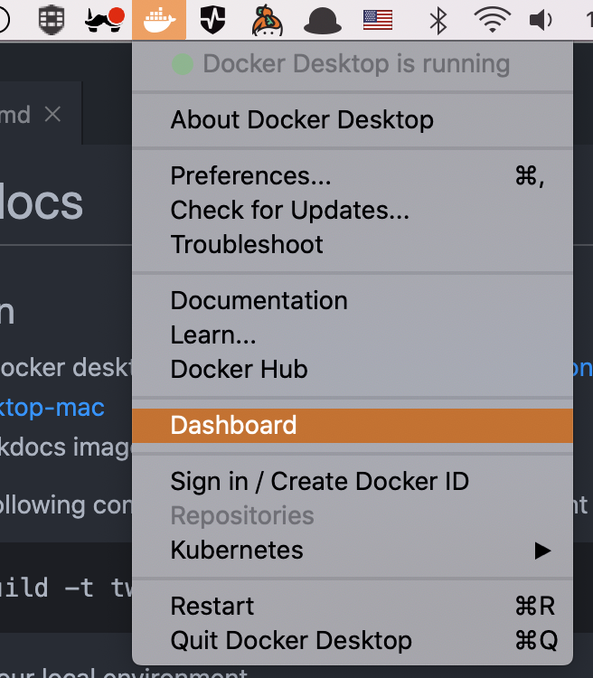

# tw-mkdocs

## Installation

1. Install Docker desktop from <https://hub.docker.com/editions/community/docker-ce-desktop-mac>
2. To build the MkDocs image, run the following command in a Terminal window in the current directory:

    ```bash
    docker build -t tw-mkdocs-img .
    ```

3. To serve your local environment, run the following command in a Terminal window:

    ```bash
    docker run --name wizeline-mkdocs-template -p 9090:9090 -v ${PWD}:/app tw-mkdocs-img:latest
    ```

    >**Note:** Use the `-d` flag in the above command to detach your terminal from the running container.

4. Navigate to <http://localhost:9090> to see your changes as you work on your documents.

## Stop MkDocs

To stop your MkDocs local environment:

1. Open Docker's dashboard



1. Locate the `wizeline-mkdocs-template` container and stop it


1. Wait until the terminal process stops.

## Restart MkDocs

You can restart the local environment in the Docker dashboard as follows:

1. Open Docker's dashboard:


1. Locate the `wizeline-mkdocs-template` container and start it:


